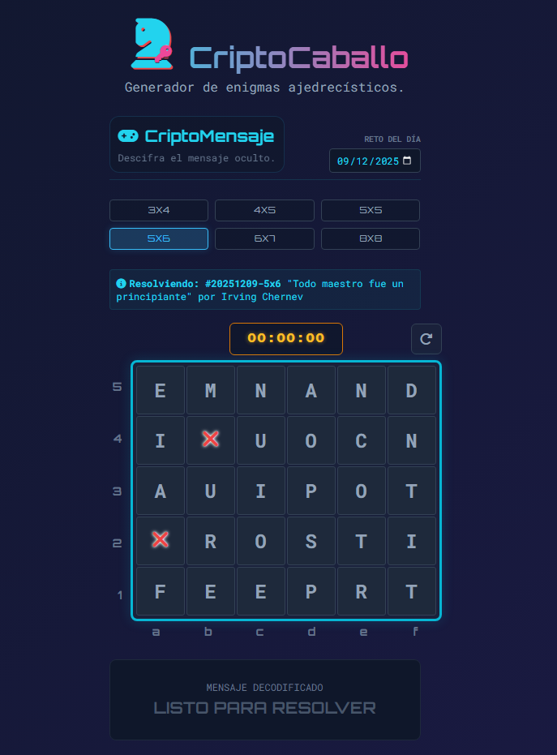

# 🕹️ ChessArcade - Level Up Your Chess Game


## 🚀 [Play Now!](https://fasmote.github.io/ChessArcade/) | [🎯 Square Rush](https://fasmote.github.io/ChessArcade/games/square-rush/index.html) | [🐴 Knight Quest](https://fasmote.github.io/ChessArcade/games/knight-quest/index.html) | [🧠 Memory Matrix](https://fasmote.github.io/ChessArcade/games/memory-matrix-v2/index.html) | [🟦 Master Sequence](https://fasmote.github.io/ChessArcade/games/master-sequence/index.html) | [⚔️ ChessInFive](https://fasmote.github.io/ChessArcade/games/chessinfive/index.html) | [🔐 Cripto-Caballo](https://fasmote.github.io/ChessArcade/games/criptocaballo/index.html) | [🔤♞ CriptoSopa](https://fasmote.github.io/ChessArcade/games/criptosopa/index.html)

---

## 🌐 English | Español

### 🇺🇸 **English Description**

**ChessArcade** is a collection of chess puzzle games with **neon retro-futuristic aesthetics** inspired by 80s synthwave culture. Transform traditional chess training into an exciting arcade experience with visual effects, electronic sounds, and gamification elements.

#### ✨ **Current Games Available:**
- **🎯 Square Rush** - Navigate coordinates A1-H8 in record time *(Available Now!)*
- **🐴 Knight Quest** - Master the knight's tour across pixel-perfect boards *(Available Now!)*
- **🧠 Memory Matrix** - Train positional memory with progressive levels *(Available Now!)*
- **🟦 Master Sequence** - Simon Says meets chess! Memorize growing patterns *(Available Now!)*
- **⚔️ ChessInFive** - Connect Four meets Chess! Two-player tactical strategy **+ AI Opponent!** *(Available Now!)*
- **🔐 Cripto-Caballo** - Decode hidden messages with knight moves! Cryptography meets chess *(Available Now!)*
- **🔤♞ CriptoSopa** - Knight-move word search with 8 progressive levels! Find chess vocabulary words by jumping like a knight across an 8×8 letter grid. Words can be found forwards or backwards! *(Available Now!)*

#### 🎯 **Features:**
- **🏆 Global Leaderboards**: Compete with players worldwide across all games
- **Responsive Design**: Optimized for desktop and mobile
- **Progressive Difficulty**: From beginner-friendly to expert challenges
- **Smart Learning**: Educational gameplay with immediate feedback
- **Audio Control**: Immersive sound effects with easy toggle
- **Cross-Game Viewing**: View any game's leaderboard from anywhere
- **Modern CSS**: Smooth animations and neon visual effects

#### 📁 **Project Structure:**
```
ChessArcade/
├── games/           # 5 playable chess arcade games
├── api/             # Serverless backend (Vercel + Supabase)
│   ├── scores/     # Leaderboard API endpoints
│   └── admin/      # Admin panel + backups
├── js/              # Shared JavaScript utilities
├── css/             # NeonChess design system
├── testing/         # Test pages for development
├── docs/            # Complete documentation
│   ├── admin/      # Admin system guides
│   └── leaderboard/# Leaderboard documentation
└── sql/             # Database schemas
```

---

### 🇪🇸 **Descripción en Español**

**ChessArcade** es una colección de juegos de rompecabezas de ajedrez con **estética retro-futurista neón** inspirada en la cultura synthwave de los 80s. Transforma el entrenamiento tradicional de ajedrez en una experiencia arcade emocionante con efectos visuales, sonidos electrónicos y elementos de gamificación.

#### ✨ **Juegos Disponibles Actualmente:**
- **🎯 Square Rush** - Navega coordenadas A1-H8 en tiempo récord *(¡Disponible Ahora!)*
- **🐴 Knight Quest** - Domina el recorrido del caballo en tableros perfectos *(¡Disponible Ahora!)*
- **🧠 Memory Matrix** - Entrena la memoria posicional con niveles progresivos *(¡Disponible Ahora!)*
- **🟦 Master Sequence** - ¡Simon Says encuentra el ajedrez! Memoriza patrones crecientes *(¡Disponible Ahora!)*
- **⚔️ ChessInFive** - ¡Conecta Cuatro conoce al Ajedrez! Estrategia táctica para dos jugadores **+ ¡Oponente IA!** *(¡Disponible Ahora!)*
- **🔐 Cripto-Caballo** - ¡Descifra mensajes ocultos con movimientos de caballo! Criptografía y ajedrez *(¡Disponible Ahora!)*
- **🔤♞ CriptoSopa** - ¡Sopa de letras con movimientos de caballo! 8 niveles progresivos para encontrar vocabulario de ajedrez saltando en "L" por un tablero 8×8. ¡Las palabras valen en ambas direcciones! *(¡Disponible Ahora!)*

#### 🎯 **Características:**
- **🏆 Ranking Global**: Compite con jugadores de todo el mundo en todos los juegos
- **Diseño Responsivo**: Optimizado para escritorio y móvil
- **Dificultad Progresiva**: Desde principiante hasta desafíos expertos
- **Aprendizaje Inteligente**: Gameplay educativo con feedback inmediato
- **Control de Audio**: Efectos de sonido inmersivos con toggle fácil
- **Vista Cross-Game**: Ve el ranking de cualquier juego desde cualquier lugar
- **CSS Moderno**: Animaciones fluidas y efectos visuales neón

---

## 🆕 Recent Updates (Enero 2025)

### 🏆 Global Leaderboard System - Live Now! (NEW!)
- ✅ **5 Games Integrated** - ChessInFive, Square Rush, Memory Matrix, Knight Quest, Master Sequence
- ✅ **Global Rankings** - Compete with players worldwide with live scoreboards
- ✅ **Country Flags** - Display your nationality next to your name (🇦🇷 🇺🇸 🇧🇷 etc.)
- ✅ **Custom Game Renderers** - Each game displays its unique scoring metadata
- ✅ **Cross-Game Viewing** - View any game's leaderboard from anywhere
- ✅ **Trophy Icons** - Consistent 🏆 leaderboard button across all games
- ✅ **Enhanced Readability** - Increased font sizes (16px base, 18px scores with glow)
- ✅ **Seamless UX** - Auto-close/auto-open flow after score submission
- ✅ **Backend Integration** - Vercel serverless + Supabase database
- 📖 **Full Documentation** - See `/games/chessinfive/docs/LEADERBOARD_INTEGRATION.md`

### ChessInFive AI v1.0.4 - Depth-2 Search + UX Improvements 🤖
- ✅ **Depth-2 AI Search** - AI now anticipates opponent threats BEFORE they happen
- ✅ **Lookahead Algorithm** - Simulates opponent's best response to each move
- ✅ **4-in-a-Row Detection** - Identifies dangerous setups that could lead to 5-in-a-row
- ✅ **Performance Optimized** - ~1 second thinking time with intelligent threat evaluation
- ✅ **Enhanced UX** - Hourglass indicator moved to side panels, stable button layout
- ✅ **Technical Report** - Complete algorithm documentation in `docs/CHESSINFIVE_AI_TECHNICAL_REPORT.md`
- ⚠️ **Known Issue** - AI doesn't yet detect existing 4-in-a-row on board (planned for v1.0.5)

### ChessInFive AI v1.0 - Production Ready! 🤖
- ✅ **AI Opponent System** - Complete Gomoku-inspired AI implementation
- ✅ **Two-Phase Strategy** - Different AI tactics for Gravity and Chess phases
- ✅ **Enhanced Threat Detection** - Blocks 3-in-a-row and 4-in-a-row in Phase 1
- ✅ **Unstoppable Recognition** - AI detects and counters unstoppable formations
- ✅ **Per-Player AI Toggles** - Independent AI controls for both players
- ✅ **AI vs AI Mode** - Watch two AIs compete autonomously
- ✅ **Last Move Highlighting** - Visual feedback (origin subtle, destination bright)
- ✅ **Closeable Victory Modal** - Analyze the game after winning
- ✅ **Production Documentation** - Complete AI_DESIGN.md with v2.0 roadmap

### Knight Quest - Coordenadas "Taxi" 🚕
- ✅ **Coordenadas visuales** en todos los tableros (a-h, 1-10)
- ✅ **Centrado perfecto** en mobile y desktop
- ✅ **Estilo de alta visibilidad** (amarillo/negro)
- ✅ **Responsive** en 3 breakpoints

### Formulario de Contacto Funcional 📧
- ✅ **Envío real de emails** a contact@chessarcade.com.ar
- ✅ **Implementación PHP** para Hostinger
- ✅ **Anti-spam** (honeypot + rate limiting)
- ✅ **UX profesional** con AJAX y animaciones

### ChessGameLibrary - Nuevo Módulo 📦
- ✅ **BoardCoordinates.js** - Sistema de coordenadas reutilizable
- ✅ **Funciones helper** para preservar coordenadas
- ✅ **Documentación completa** con ejemplos
- ✅ **Listo para usar** en todos los juegos

### Documentación Mejorada 📚
- ✅ **ERRORES_Y_SOLUCIONES.md** actualizado
- ✅ **DEPLOY_CONTACTO_HOSTINGER.md** - Guía paso a paso
- ✅ **Organización** de docs en carpetas `/docs/`

---

## 🎯 Square Rush - Perfect for Learning Chess Coordinates


### 🎮 **What is Square Rush?**
**Square Rush** is the perfect game to master chess board coordinates! Navigate from A1 to H8 in this fast-paced coordinate recognition challenge that makes learning chess notation fun and addictive.

### ✨ **Game Features:**
- **🎯 5 Progressive Levels**: From BABY STEPS (12s) to LITTLE MASTER (6s per coordinate)
- **🎮 Combo System**: Build multipliers up to x3 for higher scores
- **👶 Beginner Friendly**: Optional coordinate labels for learning
- **📱 Mobile Optimized**: Perfect touch controls for phones and tablets
- **🔊 Sound Toggle**: Immersive audio feedback with easy on/off control
- **📚 Educational**: Learn chess notation while having fun!

---

## 🐴 Knight Quest - Master the Knight's Tour!


### 🎮 **What is Knight Quest?**
**Knight Quest** challenges you to visit every square on the chessboard using only knight moves in this classic puzzle that has fascinated chess players for centuries.

### ✨ **Game Features:**
- **🏰 4 Board Sizes**: 4x4, 6x6, 8x8, and 10x10 Super Mode
- **🧠 Smart Hints**: AI-powered suggestions using Warnsdorff's algorithm
- **🏆 Ranking System**: Local leaderboards with your best performances
- **↩️ Undo System**: Take back moves to find the perfect path
- **📊 Progress Tracking**: See your improvement over time
- **🎨 Neon Aesthetics**: Beautiful cyberpunk-inspired visuals

---

## 🧠 Memory Matrix - Train Your Visual Chess Memory


### 🎮 **What is Memory Matrix?**
**Memory Matrix** challenges your ability to memorize and recreate chess positions. Watch carefully during the memorization phase, then place all pieces back exactly where they were!

### ✨ **Game Features:**
- **📊 8 Progressive Levels**: From 2 pieces (30s) to 8 pieces (10s) - increasing difficulty
- **💡 Hint System**: 6 hints per level to reveal all missing pieces temporarily
- **↩️ Undo Function**: Take back piece placements one by one
- **🎯 Smart Validation**: Real-time feedback on correct/incorrect placements
- **📱 Mobile Optimized**: Drag & drop on desktop, tap placement on mobile
- **🔊 Audio Feedback**: Synthetic sounds for glitch effects, errors, and victories

---

## 🟦 Master Sequence - NEW! Simon Says Meets Chess


### 🎮 **What is Master Sequence?**
**Master Sequence** combines the classic Simon Says game with chess coordinates! Watch the neon sequence grow, memorize the pattern, then repeat it perfectly. Each level adds ONE more square - how far can you go?

### ✨ **Game Features:**
- **📈 10+ Progressive Levels**: Sequence grows from 1 to 10+ squares with infinite mode
- **🎨 Colorful Patterns**: 8 neon colors help you memorize the sequence
- **🧠 Pattern Recognition**: Train your sequential memory and visualization
- **❤️ 3 Lives System**: Make mistakes and learn from them
- **🎯 Smart Movement**: Only king/knight moves - follows chess logic
- **🟦 Coordinate Display**: Optional coordinate labels for learning

### 🎪 **Perfect For:**
- **Memory Training**: Improve sequential memory and pattern recognition
- **Chess Visualization**: Strengthen your ability to see the board in your mind
- **All Skill Levels**: Progressive difficulty from 1 square to unlimited
- **Quick Sessions**: Perfect for 5-10 minute brain training

### 🎵 **Gameplay Experience:**
```
🟦 Level 7: Advanced
🎯 Sequence: 7 squares
❤️ Lives: 2/3 remaining
🏆 Score: 850 pts
📊 Longest: 12 squares
```

---

## ⚔️ ChessInFive - NEW! Connect Four Meets Chess + AI Opponent!


### 🎮 **What is ChessInFive?**
**ChessInFive** is a unique two-player strategy game that brilliantly combines Connect Four's gravity-drop mechanics with chess piece movement! Drop your pieces onto the board during Phase 1, then strategically move them using authentic chess rules in Phase 2 to align 5 in a row. **Now featuring a challenging AI opponent powered by Gomoku algorithms!**

### ✨ **Game Features:**
- **🎲 Two-Phase Gameplay**: Gravity placement + Chess movement
- **🤖 AI Opponent (NEW!)**: Challenge a smart AI with Gomoku-inspired threat detection
- **👥 Multiple Game Modes**:
  - Human vs Human (local multiplayer)
  - Human vs AI (cyan or magenta)
  - AI vs AI (watch two AIs battle!)
- **♟️ Authentic Chess Rules**: Each piece moves as in real chess (NO captures)
- **🎯 Strategic Depth**: Plan ahead during placement for tactical advantages
- **🎨 Enhanced UX**: Last move highlighting, closeable victory modal
- **📱 Fully Responsive**: Optimized for desktop and mobile play

### 🤖 **AI Features (v1.0.4):**
- **Depth-2 Search**: Anticipates opponent's best response before making moves
- **Intelligent Threat Detection**: Recognizes 2-5 in-a-row patterns and future threats
- **Phase 1 Strategy**: Blocks opponent's 3-in-a-row and 4-in-a-row formations
- **Phase 2 Tactics**: Gomoku-style pattern matching with lookahead evaluation
- **Mid-Game AI Toggle**: Switch AI on/off for either player during gameplay
- **Visual Feedback**: "AI is thinking..." indicator in side panels with stable layout
- **Technical Details**: See `docs/CHESSINFIVE_AI_TECHNICAL_REPORT.md` for algorithm analysis

### 🎪 **Perfect For:**
- **Strategic Thinking**: Combines positional planning with tactical execution
- **Chess Training**: Practice piece movement and tactical vision
- **AI Challenge**: Test your skills against a Gomoku-trained opponent
- **Social Gaming**: Fun competitive game for friends and family
- **All Skill Levels**: Easy to learn, challenging to master

### 🎵 **How to Play:**
```
⚔️ Phase 1: GRAVITY PLACEMENT
- Take turns dropping pieces into columns
- Pieces fall to the lowest available square
- Each player has 8 pieces: 2 Rooks, 2 Knights, 2 Bishops, 1 Queen, 1 King
- AI detects and blocks threatening formations

♟️ Phase 2: CHESS MOVEMENT
- Move your pieces using authentic chess rules
- NO captures - occupied squares block movement
- Only knights can jump over other pieces
- AI uses Gomoku patterns to create winning formations
- First to align 5 pieces in a row wins!

🤖 AI Controls:
- Toggle AI for Cyan player (left panel)
- Toggle AI for Magenta player (right panel)
- Enable both for AI vs AI spectator mode!
```

### 🔗 **[▶️ Play ChessInFive Now!](https://fasmote.github.io/ChessArcade/games/chessinfive/index.html)**

---

## 🔐 Cripto-Caballo - NEW! Decode Hidden Messages!



### 🎮 **What is Cripto-Caballo?**
**Cripto-Caballo** (Crypto-Knight) is a unique puzzle game that fuses cryptography with chess! Hidden messages are scattered across letter-filled boards, and only the knight's L-shaped path can reveal them. Follow the knight's jumps to decode famous quotes, proverbs, and philosophical phrases hidden in plain sight.

### ✨ **Game Features:**
- **📐 6 Board Sizes**: 3x4, 4x5, 5x5, 5x6, 6x7, and classic 8x8 boards
- **📅 Daily Puzzles**: New message to decode every day via Supabase integration
- **💡 Smart Hints**: Visual highlighting of valid knight moves
- **↩️ Undo System**: Take back moves to explore different paths
- **🧠 Pattern Recognition**: Train logical deduction and linguistic intuition
- **🎯 Admin Mode**: Create and test custom puzzles with password protection

### 🎪 **Perfect For:**
- **Logical Thinking**: Combines chess movement with word pattern recognition
- **Spatial Visualization**: Master the knight's complex L-shaped movement
- **Language Skills**: Decode Spanish phrases and expand vocabulary
- **Chess Training**: Develop deep understanding of knight movement patterns
- **All Skill Levels**: From simple 3x4 boards to challenging 8x8 mazes

### 🎵 **How to Play:**
```
🔐 The Challenge:
- A hidden message (quote, proverb, or phrase) is encoded on the board
- Each square contains a letter
- Only the knight's L-shaped moves connect the message
- Find the starting square and trace the path to reveal the secret!

♞ Knight Movement Rules:
- Move in an "L" shape: 2 squares in one direction, 1 square perpendicular
- Valid moves are highlighted when you select a square
- Build the message letter by letter following the knight's path
- Use UNDO to explore alternative routes

💡 Strategy Tips:
- Look for common Spanish words (EL, LA, DE, EN, etc.)
- Follow grammatical patterns (articles, prepositions)
- If stuck, try starting from different squares
- Use the hint system to see all possible moves
```

### 🔗 **[▶️ Play Cripto-Caballo Now!](https://fasmote.github.io/ChessArcade/games/criptocaballo/index.html)**

---

### 🔗 **Play All Games:**
- **🎯 [Play Square Rush](./games/square-rush/index.html)** - Master coordinates A1-H8!
- **🐴 [Play Knight Quest](./games/knight-quest/index.html)** - Conquer the knight's tour!
- **🧠 [Play Memory Matrix](./games/memory-matrix-v2/index.html)** - Train your visual memory!
- **🟦 [Play Master Sequence](./games/master-sequence/index.html)** - Master growing patterns!
- **⚔️ [Play ChessInFive](./games/chessinfive/index.html)** - Connect Four meets Chess!
- **🔐 [Play Cripto-Caballo](./games/criptocaballo/index.html)** - Decode hidden messages!
- **📁 [View Source Code](https://github.com/fasmote/ChessArcade)**
- **🐛 [Report Issues](https://github.com/fasmote/ChessArcade/issues)**

---

## 🛠️ **Technology Stack**

- **Frontend**: Vanilla HTML5, CSS3, JavaScript ES6+
- **Styling**: CSS Grid, Flexbox, Custom Properties
- **Audio**: Web Audio API for synthetic sounds
- **Storage**: localStorage for persistence
- **Responsive**: Mobile-first design approach
- **Performance**: Optimized for 60fps animations

## 🎨 **NeonChess Design System**

ChessArcade uses a custom **NeonChess Design System** featuring:

- **🌈 Neon Color Palette**: Cyan, Magenta, Green, Orange, Purple, Yellow gradients
- **⚡ Interactive Effects**: Hover animations, particle systems, glitch effects
- **🎵 Audio Feedback**: Synthetic soundscapes and UI sounds
- **📱 Mobile Optimization**: Touch-friendly controls and responsive layouts
- **🎯 Accessibility**: Keyboard navigation and high contrast modes

## 🚀 **Quick Start**

1. **Clone the repository:**
   ```bash
   git clone https://github.com/fasmote/ChessArcade.git
   cd ChessArcade
   ```

2. **Start local server:**
   ```bash
   # Python 3
   python -m http.server 8000

   # Node.js
   npx serve .
   ```

3. **Open in browser:**
   ```
   http://localhost:8000
   ```

## 🗂️ **Project Structure**

```
📁 ChessArcade/
├── 📄 index.html                    # Main landing page
├── 📁 assets/
│   ├── 📁 css/
│   │   └── neonchess-style.css      # Design system
│   ├── 📁 js/
│   │   └── neonchess-effects.js     # Interactive effects
│   └── 📁 images/                   # Screenshots and assets
├── 📁 games/
│   ├── 📁 knight-quest/             # ✅ Knight's Tour game
│   ├── 📁 square-rush/              # ✅ Coordinate training
│   ├── 📁 memory-matrix-v2/         # ✅ Visual memory training
│   ├── 📁 master-sequence/          # ✅ Master Sequence (Simon Says)
│   ├── 📁 chessinfive/              # ✅ ChessInFive + AI Opponent (Gomoku-inspired)
│   └── 📁 criptocaballo/            # ✅ Cripto-Caballo (Cryptography + Knight moves)
├── 📁 screenshots/                  # Game screenshots
└── 📁 docs/                         # Documentation
```

## 📸 **Screenshots**

### Square Rush


### Knight Quest


### Memory Matrix


### Master Sequence


### ChessInFive


---

## 🚀 **Roadmap y Planes Futuros**

### 🎮 Mejoras Planificadas para Juegos Actuales
Todos los juegos existentes recibirán mejoras continuas:
- **ChessInFive**: Sistema de notación de partidas y replay, niveles de dificultad AI (Easy/Medium/Hard), opening book
- **Knight Quest**: Más modos de juego, tableros personalizados
- **Square Rush**: Nuevos desafíos y power-ups
- **Memory Matrix**: Niveles adicionales, temas visuales
- **Master Sequence**: Modos de dificultad avanzados

### 🗄️ Backend y Base de Datos (Coming Soon!)
Próximas funcionalidades que transformarán ChessArcade:
- **🏆 Rankings Globales**: Compite con jugadores de todo el mundo
- **👤 Sistema de Usuarios**: Cuentas personales y perfiles
- **📊 Estadísticas Detalladas**: Tracking completo de progreso
- **🎖️ Sistema de Logros**: Desbloquea insignias y recompensas
- **⚡ Desafíos Diarios**: Nuevos retos cada día
- **👥 Modo Multijugador**: Compite en tiempo real

**Tecnologías Planificadas:**
- Backend: Node.js + Express o Python + FastAPI
- Base de Datos: PostgreSQL o MongoDB
- Auth: JWT + OAuth (Google, GitHub)
- Hosting: Railway, Render, o Vercel

### 🎨 Nuevos Juegos en Desarrollo
- **Vision Blitz**: Entrenamiento de visión táctica
- **Endgame Trainer**: Practica finales de ajedrez
- **Puzzle Rush**: Resuelve problemas tácticos a contrarreloj
- **Board Blindness**: Juega sin ver el tablero (memoria)

---

## 🤝 **Contributing**

We welcome contributions! Here's how you can help:

1. **🐛 Report bugs** - Found an issue? [Open an issue](https://github.com/fasmote/ChessArcade/issues)
2. **💡 Suggest features** - Have ideas? We'd love to hear them!
3. **🛠️ Submit PRs** - Fork, create a feature branch, and submit a pull request
4. **📖 Improve docs** - Help make our documentation better
5. **🎨 Design contributions** - UI/UX improvements are always welcome

### Development Guidelines:
- Follow the existing code style
- Test on both desktop and mobile
- Ensure accessibility compliance
- Add documentation for new features

## 📜 **License**

This project is licensed under the MIT License - see the [LICENSE](./LICENSE) file for details.

## 🏅 **Achievements & Stats**

- **🎯 Games Released**: 6 (Square Rush, Knight Quest, Memory Matrix, Master Sequence, ChessInFive, Cripto-Caballo)
- **⭐ GitHub Stars**: Growing!
- **🔧 Last Updated**: December 2025
- **📱 Mobile Support**: 100%
- **🌐 Browser Support**: Chrome, Firefox, Safari, Edge

---

<div align="center">

### 🎮 **Ready to Level Up Your Chess Game?**

[](https://fasmote.github.io/ChessArcade/games/square-rush/index.html)
[](https://fasmote.github.io/ChessArcade/games/knight-quest/index.html)
[](https://fasmote.github.io/ChessArcade/games/memory-matrix-v2/index.html)
[](https://fasmote.github.io/ChessArcade/games/master-sequence/index.html)
[](https://fasmote.github.io/ChessArcade/games/chessinfive/index.html)
[](https://fasmote.github.io/ChessArcade/games/criptocaballo/index.html)
[](https://github.com/fasmote/ChessArcade)

**Made with ⚡ by ChessArcade | Powered by NeonChess Design System**

</div>
